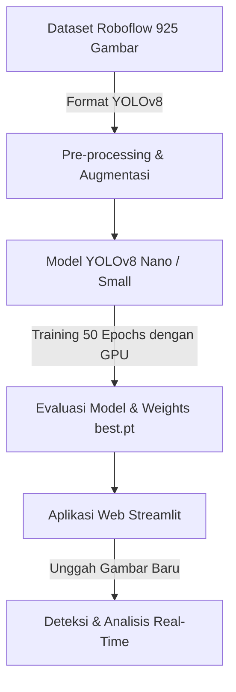

# RiceDetect AI - Deteksi Objek dan Analisis Kualitas Beras

Proyek Akhir Pembelajaran Mesin (Computer Vision) untuk melakukan deteksi objek, klasifikasi varietas, dan analisis kualitas beras berdasarkan persentase patahan menggunakan YOLOv8 dan Streamlit.

## Informasi Kelompok dan Ketentuan
* **Tujuan**: Membangun sistem deteksi objek beras yang dapat membedakan 7 kelas utama:
  1. `beras_gundukan` - Gundukan beras
  2. `beras_patah` - Butir beras yang patah
  3. `beras_utuh` - Butir beras utuh
  4. `ir42` - Varietas Beras IR42
  5. `ir64` - Varietas Beras IR64
  6. `ketan` - Varietas Beras Ketan
  7. `pandan` - Varietas Beras Pandan wangi/sejenisnya
* **Dataset**: Menggunakan dataset dari Roboflow Universe:
  - Jumlah Gambar: 925 gambar
  - Tautan Dataset: [Roboflow Universe - Deteksi Beras](https://universe.roboflow.com/project-hhgfw/deteksi-beras-jm9no/dataset/1)

---

## Struktur Repositori
```text
uas/
├── rice_detection_yolov8.ipynb   # Jupyter Notebook untuk training di Google Colab
├── app.py                       # Dashboard Web Demo menggunakan Streamlit
├── requirements.txt             # Dependensi Python untuk lokal & deployment
└── README.md                    # Dokumentasi Proyek & Laporan Panduan
```

---

## Langkah-langkah Penggunaan

### 1. Pelatihan Model (Training)
Model dapat dilatih baik secara lokal di laptop Anda (menggunakan CPU) maupun di Google Colab (menggunakan GPU gratis) menggunakan berkas `rice_detection_yolov8.ipynb`:

#### A. Opsi 1: Pelatihan Lokal (Laptop / CPU)
1. Aktifkan virtual environment Anda dan pastikan dependensi telah terinstal:
   ```bash
   source venv/bin/activate
   pip install -r requirements.txt
   ```
2. Pastikan Anda telah membuat berkas `.env` di direktori utama dan memasukkan API Key Roboflow Anda:
   ```env
   ROBOFLOW_API_KEY=isi_api_key_anda_disini
   ```
3. Jalankan server Jupyter:
   ```bash
   jupyter notebook
   ```
   Buka berkas `rice_detection_yolov8.ipynb` di browser Anda.
4. Jalankan sel secara berurutan. Kode notebook telah dirancang secara adaptif: apabila mendeteksi tidak adanya GPU (CPU-only), sistem otomatis membatasi jumlah training menjadi **5 epoch** dengan ukuran batch **8** agar laptop Anda tidak kelebihan beban (*freeze*).

#### B. Opsi 2: Pelatihan Google Colab (GPU T4)
1. Unggah berkas `rice_detection_yolov8.ipynb` ke Google Drive atau langsung impor ke Google Colab.
2. Aktifkan akselerasi perangkat keras: **Runtime** > **Change runtime type** > pilih **T4 GPU**.
3. Daftarkan API Key Roboflow Anda di panel **Secrets** (ikon kunci di sebelah kiri) dengan nama kunci `ROBOFLOW_API_KEY`. Aktifkan opsi **Notebook access**.
4. Jalankan semua sel. Bobot model terbaik (`best.pt`) serta data konfigurasi akan otomatis di-backup secara aman ke Google Drive Anda pada direktori `Rice_Detection_YOLOv8/`.


### 2. Menjalankan Demo Streamlit secara Lokal
Setelah mendapatkan model `best.pt` dari Google Colab, Anda dapat menjalankan demo secara lokal:

1. Aktifkan virtual environment python:
   ```bash
   source venv/bin/activate  # Untuk Linux/macOS
   # atau
   .\venv\Scripts\activate     # Untuk Windows
   ```
2. Instal semua dependensi:
   ```bash
   pip install -r requirements.txt
   ```
3. Letakkan berkas bobot model `best.pt` hasil training di direktori utama proyek ini:
   * **Jika melatih di Google Colab**: Unduh berkas `best.pt` dari Google Drive Anda di folder `Rice_Detection_YOLOv8/` lalu letakkan di direktori utama ini.
   * **Jika melatih secara lokal**: Salin berkas `best.pt` dari subdirektori `rice_detection/yolov8n_rice/weights/best.pt` ke direktori utama ini.
4. Jalankan aplikasi Streamlit:
   ```bash
   streamlit run app.py
   ```
5. Akses aplikasi di browser Anda di alamat `http://localhost:8501`.
6. Jika Anda belum menyelesaikan training model, aplikasi akan otomatis berjalan dalam Mode Demo (menggunakan visualisasi simulasi deteksi pada gambar yang diunggah). Anda juga bisa mengunggah file `best.pt` langsung dari panel samping aplikasi.

---

## Metodologi Proyek

### A. Alur Kerja Deteksi Objek (Object Detection Pipeline)


### B. Rumus Kualitas Beras
Untuk menilai kualitas beras, sistem menghitung persentase beras patah (broken percentage) terhadap total butir beras utuh dan patah yang terdeteksi:
$$\text{Persentase Patahan} = \left( \frac{\text{Jumlah Beras Patah}}{\text{Jumlah Beras Utuh} + \text{Jumlah Beras Patah}} \right) \times 100\%$$

Berdasarkan SNI (Standar Nasional Indonesia), beras diklasifikasikan sebagai:
- **Premium (Grade A)**: Persentase patahan $\le 15\%$
- **Medium (Grade B)**: Persentase patahan $15\% - 25\%$
- **Rendah (Grade C)**: Persentase patahan $> 25\%$

---

## Struktur Laporan Akhir dan Presentasi

### Kerangka Laporan Akhir (Laporan KP / Tugas Akhir)
1. **Bab 1: Pendahuluan**
   * Latar Belakang (Pentingnya analisis kualitas dan klasifikasi varietas beras otomatis untuk industri pertanian pangan).
   * Rumusan Masalah & Batasan Masalah.
   * Tujuan Tugas.
2. **Bab 2: Landasan Teori**
   * Pengenalan Deep Learning & Computer Vision.
   * Algoritma YOLOv8 (You Only Look Once) untuk Deteksi Objek Real-time.
   * Kelas Kualitas & Varietas Beras (SNI).
3. **Bab 3: Metodologi Penelitian**
   * Akuisisi Data (Dataset Roboflow 925 gambar, 7 kelas).
   * Pra-pemrosesan Data (Augmentasi gambar, normalisasi ukuran ke 640x640).
   * Arsitektur YOLOv8n.
   * Skenario Eksperimen (Batch size, Epochs, Learning Rate).
4. **Bab 4: Hasil dan Analisis**
   * Kurva Training (Bounding Box Loss, Class Loss).
   * Analisis Confusion Matrix (Melihat kelas mana yang sering tertukar, misalnya `ir64` dan `pandan`).
   * Metrik Evaluasi: Precision, Recall, F1-Score, dan mAP@0.5.
   * Uji coba inferensi dengan beberapa sampel gambar uji.
5. **Bab 5: Kesimpulan dan Saran**
   * Kesimpulan efektivitas model YOLOv8.
   * Saran pengembangan (misal penambahan jumlah dataset untuk varietas yang mirip, atau penggunaan kamera dengan pencahayaan konstan).

### Slide Presentasi (10-15 Menit)
* **Slide 1**: Judul Proyek & Nama Anggota Kelompok.
* **Slide 2**: Latar Belakang & Masalah (Mengapa klasifikasi beras secara manual tidak efisien).
* **Slide 3**: Penjelasan Dataset Roboflow (Distribusi kelas dan contoh gambar berlabel).
* **Slide 4**: Arsitektur & Parameter Model YOLOv8 yang dipilih.
* **Slide 5**: Proses Training (Grafik Loss & mAP).
* **Slide 6**: Evaluasi Model (Confusion Matrix & F1-Score).
* **Slide 7**: Demo Aplikasi Streamlit (Screenshot atau demo langsung).
* **Slide 8**: Kesimpulan & Pembagian Tugas Anggota Kelompok.
